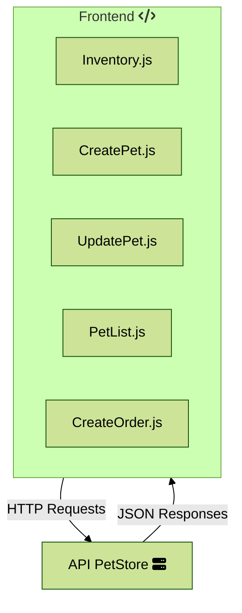
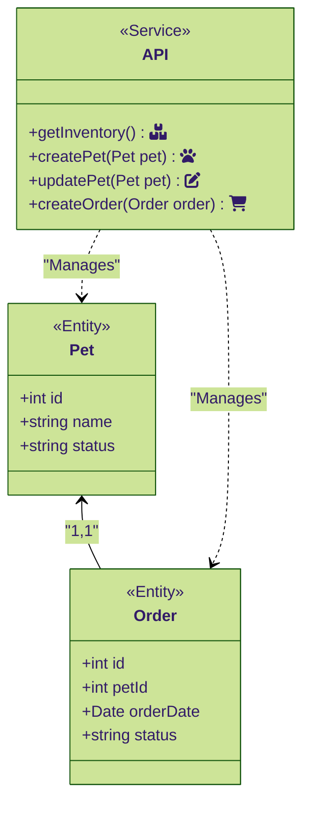
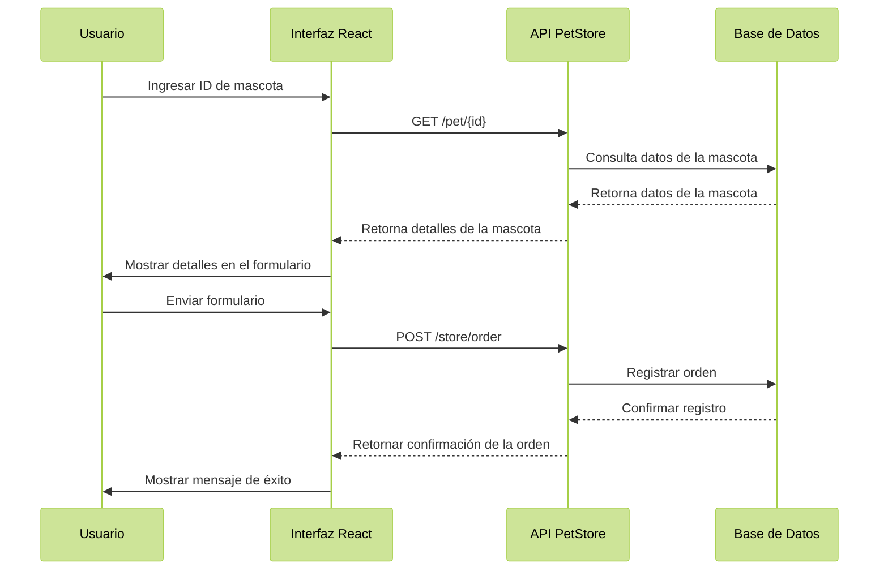

# 🐶 Guía de Usuario: Gestionando Mascotas en la PetStore API 🐱

✨ **Bienvenido al Sistema de Gestión de Mascotas** ✨

Esta guía te proporcionará los pasos necesarios para usar nuestra aplicación desplegada. Desde registrar nuevas mascotas hasta gestionar pedidos de compra, esta guía te ayudará en cada acción que necesites realizar.

## 🏠 Introducción al Producto

Nuestra aplicación está diseñada para:

- Crear y actualizar datos de mascotas.
- Consultar el inventario disponible en la tienda.
- Realizar pedidos de compra de mascotas.
- Gestionar las acciones de manera sencilla y rápida.

La aplicación se basa en tecnologías modernas como React, TailwindCSS y la API de PetStore.

## 🔍 Cómo Acceder a la Aplicación

1. Abre tu navegador favorito (Google Chrome, Firefox, Edge, etc.).
2. Dirígete a la siguiente URL: [Api Mascotitas](https://andresalmeida.github.io/react-petstore/) - GitHub Pages 👾
3. O, si prefieres, dirígete a la siguiente URL: [Api Mascotitas](https://fhsl9f-3000.csb.app/) - CodeSandBox 📎
4. Asegúrate de contar con conexión a internet estable.

## 📖 Guía Paso a Paso

### 1. Crear una Mascota Nueva

1. Haz clic en la pestaña Crear Mascota en el menú principal.
2. Rellena el formulario con los siguientes datos:
   - Nombre de la mascota (Ej.: “Firulais”).
   - Estado (“Disponible”, “Vendido” o “Pendiente”).
3. Presiona el botón Guardar. 🎉
4. Aparecerá un mensaje de éxito confirmando que la mascota se creó correctamente.


> 👀 **Nota**: Si olvidas algún campo, la aplicación te lo notificará para que puedas completarlo antes de guardar.

### 2. Actualizar los Datos de una Mascota

1. Ve a la pestaña "**Lista de Mascotas**".
2. Identifica la mascota que deseas actualizar.
3. Copia el **ID** de la mascota que deseas editar.
4. Ve a la pestaña "**Actualizar Mascota**".
5. Modifica los campos necesarios (nombre o estado).
6. Haz clic en "**Actualizar**".
7. Aparecerá un mensaje confirmando los cambios. 🎉


### 3. Ver la Lista de Mascotas

1. Haz clic en la pestaña Lista de Mascotas.
2. Verás un listado con todas las mascotas registradas, incluyendo su:
   - **ID**: Identificador único de la mascota.
   - **Nombre**: Nombre de la mascota.
   - **Estado**: Estado actual de la mascota ("Disponible", "Vendido", "Pendiente").'

> 👀 **Nota**: Puedes utilizar filtros para ordenar las mascotas por estado, pues la lista es muy larga y la API está constantemente registrando mascotas.


### 4. Consultar el Inventario de la Tienda

1. Ve a la pestaña Inventario.
2. Observa la cantidad de mascotas disponibles, clasificadas por estado (“Disponible”, “Pendiente”, etc.).


### 5. Crear una Orden para Comprar una Mascota

1. En la lista de mascotas, selecciona la mascota que deseas comprar.
2. Copia el **ID** de la mascota que deseas editar.
4. Ve a la pestaña "**Crear Orden**".
5. Llena los campos necesarios (nombre y fecha de entrega).
3. Haz clic en el botón "**Comprar**".
4. Aparecerá un mensaje de confirmación con el éxito de la compra. ✨


> 👀 **Nota**: Ten en cuenta que, dependiendo de la disponibilidad, algunas mascotas podrían no estar disponibles para su compra en ese momento.

## 💻 Ejemplos de Código

Estos componentes React muestran la implementación de las principales funcionalidades de la aplicación. Cada componente utiliza estados (useState) para manejar los datos del formulario y modales de confirmación.

### Crear Mascota (CreatePet.js)

Este componente maneja la creación de nuevas mascotas. Utiliza un formulario simple con campos para el nombre y el estado de la mascota. Al crear exitosamente, muestra un modal de confirmación con el nombre de la mascota creada.

```javascript
// Crear Mascota

const CreatePet = () => {
  const [name, setName] = useState("");
  const [status, setStatus] = useState("available");
  const [showModal, setShowModal] = useState(false); // Estado para mostrar/ocultar el modal
  const [petName, setPetName] = useState(""); // Almacena el nombre de la mascota creada

  const handleSubmit = async (e) => {
    e.preventDefault();
    const pet = { name, status };
    try {
      const response = await createPet(pet);
      setPetName(response.name); // Guarda el nombre de la mascota creada
      setShowModal(true); // Muestra el modal de confirmación
    } catch (error) {
      console.error("Error al crear la mascota:", error);
    }
  };
```
> ⚠️ **Nota**: El estado por defecto de una nueva mascota es "available" (disponible). Asegúrate de que el nombre sea descriptivo y único para facilitar su identificación posterior.

### Actualizar Mascota (UpdatePet.js)

Permite modificar los datos de una mascota existente usando su ID. Los usuarios pueden actualizar tanto el nombre como el estado de la mascota. Incluye validación del ID y confirmación visual de la actualización.

```javascript
// Actualizar Mascota

const UpdatePet = () => {
  const [id, setId] = useState("");
  const [name, setName] = useState("");
  const [status, setStatus] = useState("available");
  const [showModal, setShowModal] = useState(false); // Estado para mostrar/ocultar el modal
  const [petName, setPetName] = useState(""); // Almacena el nombre de la mascota actualizada

  const handleSubmit = async (e) => {
    e.preventDefault();
    const pet = { id: parseInt(id), name, status };
    try {
      const response = await updatePet(pet);
      setPetName(response.name); // Guarda el nombre de la mascota actualizada
      setShowModal(true); // Muestra el modal de confirmación
    } catch (error) {
      console.error("Error al actualizar la mascota:", error);
    }
  };
```
> ⚠️ **Nota**: Es crucial ingresar un ID válido de una mascota existente. Si el ID no existe, la aplicación mostrará un error.

### Crear Orden (CreateOrder.js)

Este componente gestiona la creación de órdenes de compra. Incluye verificación de disponibilidad de la mascota, manejo de fechas de entrega y validación del estado de la mascota antes de procesar la orden.

```javascript
// Crear Orden

const BASE_URL = "https://petstore.swagger.io/v2";

const CreateOrder = () => {
  const [petId, setPetId] = useState("");
  const [deliveryDate, setDeliveryDate] = useState(""); // Nueva fecha de entrega
  const [showModal, setShowModal] = useState(false);
  const [orderId, setOrderId] = useState(null);
  const [errorMessage, setErrorMessage] = useState("");

  const checkPetAvailability = async (id) => {
    try {
      const response = await fetch(`${BASE_URL}/pet/${id}`);
      if (!response.ok) {
        throw new Error(`Mascota no encontrada o error al consultar: ${response.statusText}`);
      }
      const pet = await response.json();
      return pet.status === "available";
    } catch (error) {
      console.error("Error al verificar el estado de la mascota:", error);
      setErrorMessage("Error al verificar el estado de la mascota. Inténtelo de nuevo.");
      return false;
    }
  };

  const handleSubmit = async (e) => {
    e.preventDefault();
    setErrorMessage("");
    const isAvailable = await checkPetAvailability(petId);

    if (!isAvailable) {
      setErrorMessage("La mascota no está disponible para la compra.");
      return;
    }

    const order = {
      petId: parseInt(petId),
      deliveryDate, // Incluimos la fecha de entrega
      status: "placed",
    };

    try {
      const response = await createOrder(order);
      setOrderId(response.id);
      setShowModal(true);
    } catch (error) {
      console.error("Error al crear la orden:", error);
      setErrorMessage("Error al crear la orden. Inténtelo de nuevo.");
    }
  };

  const closeModal = () => {
    setShowModal(false);
    setPetId("");
    setDeliveryDate("");
    setErrorMessage("");
  };
```
> ⚠️ **Nota**
> - La fecha de entrega es obligatoria
> - Si la mascota no está disponible, se mostrará un mensaje de error
> - Las órdenes creadas exitosamente reciben un ID único de confirmación
> - El componente limpia automáticamente el formulario después de una orden exitosa

### 💁🏻 **¿Buscas la versión interactiva para probar la funcionalidad?**

- Puedes [abrir la aplicación en una nueva ventana](https://fhsl9f-3000.csb.app/).
- Este link te guiará a la vista previa interactiva de la aplicación en CodeSandbox.😼


## 🎨 Diagramas Explicativos

Los diagramas que se muestran a continuación, muestran cómo se encuentra desarrollada la aplicación, por ello, servirán de guía para entender cómo fue implementada en el aplicativo usando React.

### Diagrama de Componentes

Este diagrama muestra cómo interactúan los principales componentes del sistema: la aplicación React y la API de PetStore.


> 🤓☝🏻 **Explicación**: La aplicación React se encarga de la interfaz de usuario (UI), y se comunica con la API para enviar y recibir datos en formato JSON. Este flujo asegura que la información esté siempre actualizada.

### Diagrama de Clases

Este diagrama muestra la estructura de las clases utilizadas en la aplicación, que interactúan entre sí para gestionar las mascotas y las órdenes de compra.


> 🤓☝🏻 **Explicación**
> - La clase `Mascota` tiene los atributos que definen a cada mascota en el sistema, como `id`, `nombre`, `estado`, y métodos para crear, actualizar y eliminar mascotas.
> - La clase `Orden` maneja los pedidos realizados por los clientes para comprar mascotas. Cada orden está vinculada a una mascota específica y tiene métodos para crear, actualizar o cancelar una orden.
> - La clase `Inventario` maneja el listado de mascotas disponibles, permitiendo consultar y actualizar el inventario.

### Diagrama de Secuencia

El diagrama de secuencia a continuación muestra cómo se realiza la creación de una nueva mascota, desde que el usuario llena el formulario hasta que el sistema guarda la información.



> 🤓☝🏻 **Explicación**: El usuario ingresa los datos en el formulario de la aplicación frontend, que luego envía una solicitud a la API. La API procesa la información y confirma el éxito, lo que se refleja en la interfaz del usuario.

## 🚨 Notas y Consejos Adicionales
- **Seguridad**: La aplicación está diseñada para ser intuitiva y fácil de usar, pero recuerda **no** ingresar datos sensibles, pues es una API pública que está en uso recurrentemente.
- **Actualizaciones**: Si realizas cambios en los datos de una mascota, asegúrate de guardar los cambios antes de navegar a otra sección.
